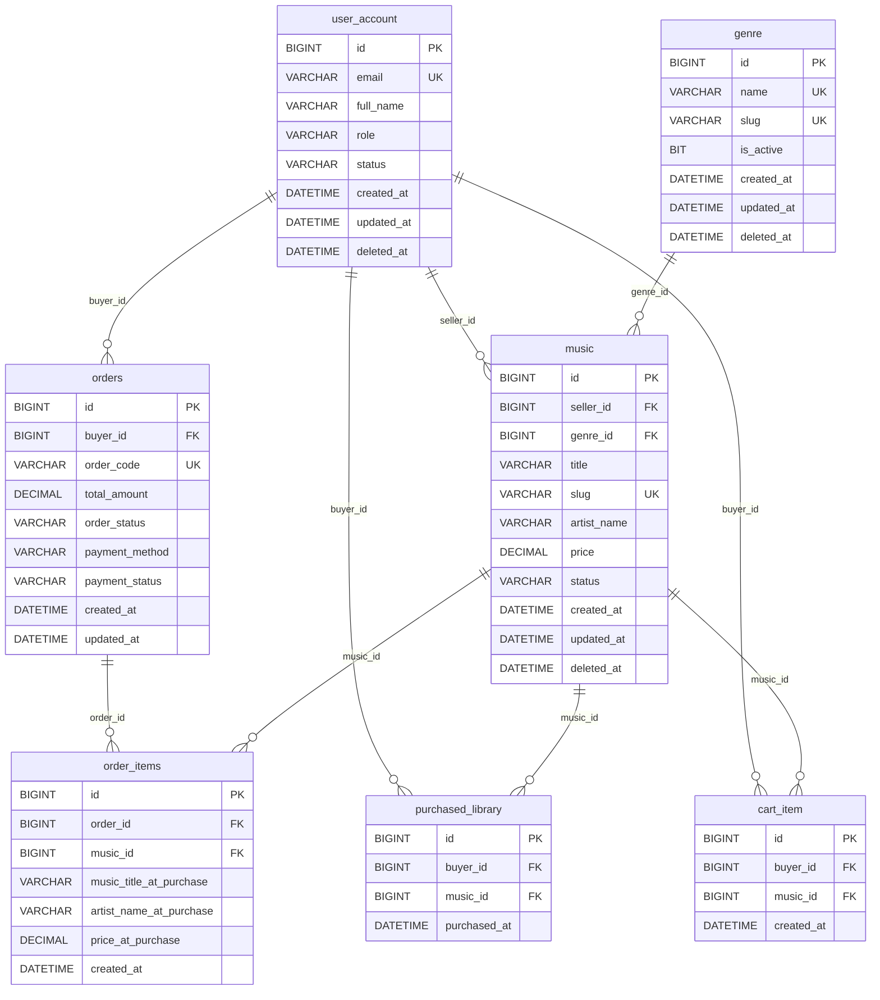
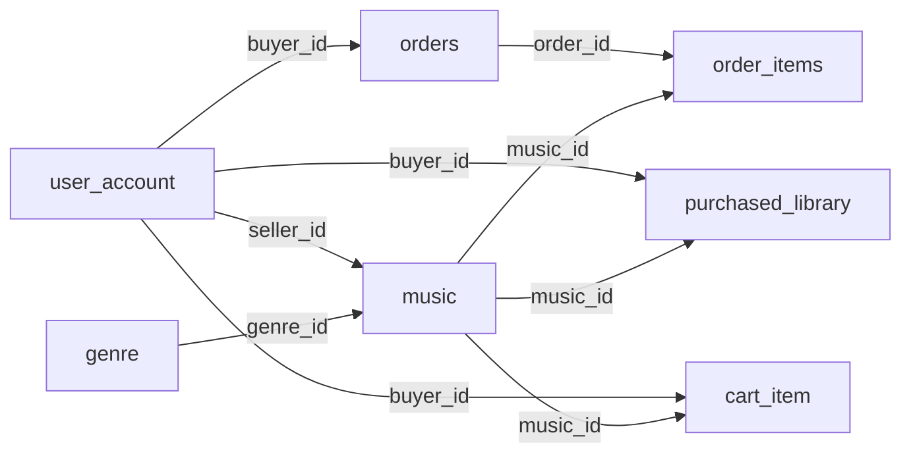

# ERD - Ecommerce Music Marketplace

## Tổng Quan Nhanh

## Ghi Chú Thiết Kế

- `payment_method` và `payment_status` được lưu trực tiếp trong `orders`, chưa tách bảng `payments` riêng trong MVP.
- `order_items` giữ snapshot dữ liệu tại thời điểm mua để lịch sử đơn hàng không bị ảnh hưởng khi metadata của `music` thay đổi.
- `purchased_library` là bảng kiểm tra ownership chính thức cho luồng download và authorization.
- `cart_item` là bảng tạm cho giỏ hàng, có unique constraint trên `(buyer_id, music_id)` để tránh trùng item.
- Các bảng có `deleted_at` đều dùng soft delete, nên truy vấn public phải lọc `deleted_at is null`.

## Luồng Quan Hệ Chính

1. Một `user_account` theo role `SELLER` có thể sở hữu nhiều `music`.
2. Một `genre` có thể được gắn cho nhiều `music`.
3. Một `user_account` theo role `BUYER` có thể tạo nhiều `orders`.
4. Một `orders` có nhiều `order_items`.
5. Một `music` có thể xuất hiện trong nhiều `order_items`, `purchased_library`, và `cart_item`.
6. Một `user_account` theo role `BUYER` có thể có nhiều mục trong `purchased_library` và `cart_item`.

## Related

- [[Database-Design]]
- [[Table-User]]
- [[Table-Genre]]
- [[Table-Music]]
- [[Table-Order]]
- [[Table-Payment]]
- [[Table-Cart]]