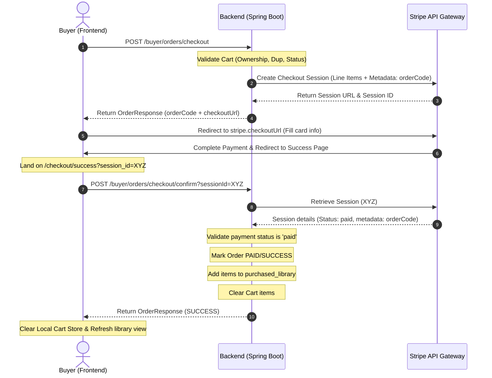

# Spec: Stripe Payment Integration

## Problem

Hiện tại hệ thống AI Music đang sử dụng phương thức thanh toán giả lập (Sandbox) tự động hoàn thành đơn hàng với kết quả `SUCCESS` ngay lập tức. Buyer không trải qua quy trình thanh toán thực tế nào và thông tin thẻ thanh toán trên giao diện chỉ là các trường nhập ảo. 

Cần thay thế cơ chế giả lập này bằng cổng thanh toán **Stripe Checkout** thực tế sử dụng Stripe API Key được cấu hình trên backend, đồng thời cập nhật luồng xử lý đơn hàng trên cả frontend và backend để đảm bảo an toàn giao dịch.

## Goal

- Tích hợp Stripe Java SDK vào backend để khởi tạo phiên thanh toán Stripe Checkout Session.
- Loại bỏ hoàn toàn logic giả lập `processSandboxPayment` tự động thành công.
- Cập nhật luồng checkout: đơn hàng khi tạo mới sẽ ở trạng thái `PENDING` (chưa thanh toán), và chỉ được cập nhật sang `PAID` / `SUCCESS` sau khi Stripe xác nhận thanh toán thành công thông qua API xác thực Session.
- Cập nhật frontend: Loại bỏ form nhập thẻ cứng ảo, thay thế bằng giao diện tóm tắt đơn hàng gọn gàng với nút "Pay with Stripe" dẫn tới trang thanh toán bảo mật của Stripe.
- Trang Checkout Success trên frontend sẽ xác thực thanh toán với backend qua Stripe Session ID trước khi xóa giỏ hàng local và hiển thị giao diện thành công.

## Scope

### In scope

- **Backend (Spring Boot):**
  - Thêm thư viện `com.stripe:stripe-java` vào project.
  - Cấu hình biến môi trường `stripe.api.key` (lấy từ biến môi trường `STRIPE_API_KEY`).
  - Thêm `STRIPE` vào enum `PaymentMethod`.
  - Cập nhật `OrderResponse` để chứa thêm trường `checkoutUrl` (dùng để chuyển hướng sang Stripe Checkout).
  - Cập nhật logic `OrderService.checkout()`: tạo đơn hàng `PENDING`, tạo Stripe Checkout Session với thông tin chi tiết từng track nhạc (Line Items), trả về URL thanh toán.
  - Thêm endpoint xác nhận đơn hàng: `POST /api/v1/buyer/orders/checkout/confirm?sessionId={sessionId}`. Nếu thanh toán thành công trên Stripe, cập nhật trạng thái đơn hàng thành `PAID`, cấp quyền sở hữu trong `purchased_library`, và xóa giỏ hàng của buyer.
  
- **Frontend (Next.js):**
  - Cập nhật trang `/checkout` (`CheckoutPageView`): loại bỏ thẻ credit card ảo, thêm nút thanh toán chuyển hướng người dùng tới Stripe Checkout URL.
  - Cập nhật trang `/checkout/success` (`CheckoutSuccessPageView`): lấy `session_id` từ URL params, gọi API xác nhận của backend `/buyer/orders/checkout/confirm` để kích hoạt giao dịch và lấy mã đơn hàng, hiển thị kết quả thành công và dọn dẹp giỏ hàng local.

### Out of scope

- Xử lý các webhook sự kiện khác ngoài Stripe Checkout Session Redirect.
- Quy trình hoàn tiền (Refund) hoặc hủy đơn hàng chủ động từ phía khách hàng (Cancel flow).
- Thanh toán định kỳ (Subscription) hoặc chia nhỏ thanh toán.

## User Flow



## Technical Design

### Backend changes

1. **Gradle Dependency (`build.gradle`):**
   ```groovy
   implementation 'com.stripe:stripe-java:28.3.0'
   ```

2. **Configuration (`application.properties`):**
   ```properties
   stripe.api.key=${STRIPE_API_KEY}
   ```
   *Lưu ý: API Key thực tế sẽ được đưa vào môi trường thông qua file `.env`.*

3. **Enum Update (`PaymentMethod.java`):**
   ```java
   public enum PaymentMethod {
       SANDBOX,
       STRIPE
   }
   ```

4. **DTO Updates (`OrderResponse.java`):**
   ```java
   public class OrderResponse {
       // ... Các trường hiện tại
       private String checkoutUrl; // transient field trả về cho frontend redirect
   }
   ```

5. **API Updates (`OrderController.java`):**
   - **Checkout API (`POST /api/v1/buyer/orders/checkout`):**
     Sử dụng `OrderResponse` chứa `checkoutUrl`.
   - **Confirm API (`POST /api/v1/buyer/orders/checkout/confirm`):**
     Nhận tham số query `sessionId`, kiểm tra trạng thái thanh toán từ Stripe, cập nhật trạng thái cơ sở dữ liệu và hoàn tất đơn hàng.
     ```java
     @PostMapping("/buyer/orders/checkout/confirm")
     @PreAuthorize("hasRole('BUYER')")
     public ResponseEntity<ApiResponse<OrderResponse>> confirmCheckout(@RequestParam String sessionId)
     ```

6. **Service Updates (`OrderService.java` & `OrderServiceImpl.java`):**
   - Thay đổi `checkout()`:
     - Tạo bản ghi `Order` với `paymentStatus = PENDING`, `orderStatus = PENDING`, `paymentMethod = STRIPE`.
     - Tạo các bản ghi `OrderItem` lưu thông tin snapshot bài hát.
     - Khởi tạo danh sách `SessionCreateParams.LineItem` dựa trên các bài hát trong giỏ hàng (tên bài hát, ảnh đại diện, giá tiền * 100 chuyển thành cents/USD).
     - Thiết lập URL thành công: `http://localhost:3000/checkout/success?session_id={CHECKOUT_SESSION_ID}`.
     - Lưu `orderCode` vào metadata của Session.
     - Gọi `Session.create()` để nhận checkout URL.
     - Trả về `OrderResponse` kèm `checkoutUrl`.
     - *Lưu ý: Không xóa giỏ hàng và không tạo PurchasedLibrary tại bước này.*
   - Triển khai `confirmCheckout(String sessionId)`:
     - Lấy Checkout Session từ Stripe qua ID.
     - Kiểm tra trạng thái thanh toán (`session.getPaymentStatus().equals("paid")`).
     - Lấy `orderCode` từ metadata của session.
     - Truy vấn `Order` theo `orderCode`. Nếu đã ở trạng thái `PAID` (được xác thực trước đó), chỉ việc trả về kết quả (đảm bảo tính idempotent).
     - Nếu chưa thanh toán:
       - Cập nhật trạng thái `paymentStatus = SUCCESS`, `orderStatus = PAID`.
       - Lưu bản ghi `PurchasedLibrary` cho buyer đối với các bài hát trong đơn hàng.
       - Xóa toàn bộ giỏ hàng của buyer tương ứng với các bài hát trong đơn hàng đó.
       - Trả về kết quả.

### Frontend changes

1. **`checkout-page-view.tsx`:**
   - Loại bỏ các state liên quan đến form nhập thẻ ảo.
   - Loại bỏ hoàn toàn khối Card "Payment method" và "Billing details" nhập tay giả lập.
   - Thay thế bằng giao diện hiển thị thông tin thanh toán an toàn bảo mật qua Stripe: Logo Stripe, Trust Badges, cam kết bảo mật.
   - Nút hành động đổi thành "Proceed to Stripe Payment". Khi click, gọi `api.post("/buyer/orders/checkout")`, nhận kết quả và thực hiện chuyển hướng `window.location.href = data.checkoutUrl`.

2. **`checkout-success-page-view.tsx`:**
   - Đọc `session_id` từ URL query parameters.
   - Nếu có `session_id`:
     - Hiển thị màn hình tải/xác thực: "Confirming your payment with Stripe..." cùng hiệu ứng spinner.
     - Gọi API backend `POST /api/v1/buyer/orders/checkout/confirm?sessionId={sessionId}`.
     - Khi nhận kết quả thành công:
       - Lưu/Hiển thị `orderCode` từ response.
       - Gọi `clearCart()` để dọn sạch giỏ hàng cục bộ.
       - Gọi `refreshOwnedTrackIds()` để cập nhật quyền nghe/tải nhạc ngay lập tức.
       - Chuyển sang trạng thái giao diện thành công.
     - Nếu thất bại:
       - Hiển thị thông báo lỗi thanh toán hoặc xác thực thất bại.

## Edge Cases

- **Khách hàng reload trang success:**
  Khi reload, API `confirmCheckout` sẽ được gọi lại với cùng một `sessionId`. Backend kiểm tra thấy đơn hàng đã được cập nhật `PAID` trước đó, trả về thành công ngay lập tức để tránh lỗi.
- **Thanh toán bị hủy hoặc thất bại trên Stripe:**
  Người dùng sẽ quay lại trang checkout hoặc đóng tab. Giỏ hàng của họ vẫn được giữ nguyên và đơn hàng ở DB backend vẫn ở trạng thái `PENDING`.
- **Khách hàng thanh toán nhưng không chuyển hướng về trang success (Ví dụ tắt trình duyệt ngay sau khi thanh toán thành công):**
  Trong scope này, chúng ta tập trung vào luồng chuyển hướng trực tiếp của người dùng. Một giải pháp xử lý triệt để trong tương lai là tích hợp webhook lắng nghe sự kiện `checkout.session.completed` từ Stripe để hoàn tất đơn hàng bất đồng bộ.

## Acceptance Criteria

1. Khi click nút thanh toán trên trang checkout, người dùng phải được chuyển sang đúng giao diện Stripe Checkout hiển thị chính xác tên, ảnh thumbnail và giá tiền của từng track nhạc.
2. Sau khi thanh toán thành công bằng thẻ test của Stripe (`4242 4242 4242 4242`), trình duyệt tự động chuyển hướng về trang success của Next.js với tham số `session_id`.
3. Trang success hiển thị spinner xác thực, gọi thành công endpoint `/buyer/orders/checkout/confirm` trên Spring Boot.
4. Đơn hàng trong cơ sở dữ liệu được cập nhật trạng thái `payment_status = 'SUCCESS'`, `order_status = 'PAID'`, `payment_method = 'STRIPE'`.
5. Các bài hát đã mua được thêm vào bảng `purchased_library` của tài khoản buyer tương ứng.
6. Giỏ hàng của buyer được làm sạch hoàn toàn cả ở database backend và local state store trên frontend.
7. Khi reload lại trang success, trang vẫn hoạt động bình thường và không báo lỗi.
